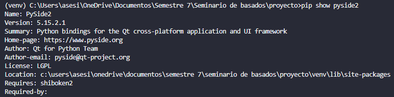
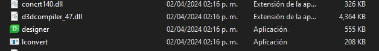

# Instalacion para ejecutar el programa

## Requisitos
- Python 3.7.9

## Pasos a seguir
1. Descargar Python 3.7.9
2. Descargar el repositorio
```bash
git clone https://github.com/askr3d/diagnosticoMedico.git
```
3. Si prefieres usar entorno virtual:
    1. Ejecutar ```python -m venv <nombre_de_su_entorno>``` (normalmente al entorno se le pone "venv")
    2. Ejecutar el `activate.bat` este archivo esta en el entorno virtual y ejecutas en la consola ```.\venv\Scripts\activate```
    3. Para verificar que este activo veras un `(venv)` al principio de cada linea de la consola

4. Instalar las dependencias ejecutando ```pip install -r requirements.txt```
5. Una vez instalado ya pueden ejecutar python main.py

## Editar con QtDesigner
1. Ejecutar en la consola con el entorno activado ```pip show pyside2```

Saldra algo asi 

2. Copiar la ruta de `Location:` y pegarla en el explorador de archivos
3. Ir a la carpeta `PySide2` y ejectuar la aplicacion que diga `designer`


